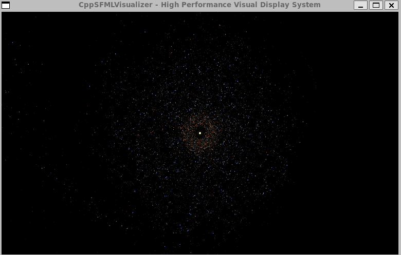

# CppSFMLVisualizer

A high-performance 2D visual display system showcasing modern C++23 features with SFML, featuring a realistic Milky Way galaxy simulation.

## Demo



## Features

- **Milky Way Galaxy Simulator**: Realistic spiral galaxy with varied star types and sizes
- **GPU-Accelerated Rendering**: Efficient vertex array rendering for smooth 60+ FPS performance
- **Multi-threaded Physics Engine**: Parallel N-body gravitational simulation
- **Real-time Interaction**: Add celestial bodies, adjust time dilation, switch presets
- **Modern C++23**: Utilizing concepts, ranges, and modern C++ features

## Building

### Requirements
- C++23 compatible compiler (GCC 13+, Clang 16+, MSVC 2022+)
- CMake 3.25+
- SFML 2.6+
- OpenGL
- Ninja build system (optional but recommended)

### Quick Build
```bash
./b          # Build in Release mode (default)
./b Debug    # Build in Debug mode
```

The build system automatically:
- Uses Clang++ compiler if available
- Uses Ninja build system for faster builds
- Enables Release mode with -O3 optimization by default

### Run
```bash
./r                  # Build and run in Release mode
./r Debug            # Build and run in Debug mode
./r Release --fullscreen  # Run fullscreen
```

### Test
```bash
./t          # Build and run tests in Release mode
./t Debug    # Build and run tests in Debug mode
./t Debug -s # Run tests with detailed output
```

## Controls

### Particle Galaxy Mode
- **1-5**: Switch between galaxy presets
- **Left Click**: Add massive object at cursor
- **Scroll Wheel**: Adjust time dilation
- **Space**: Pause/Resume simulation
- **T**: Toggle object trails
- **G**: Toggle grid
- **R**: Reset current preset
- **Escape**: Exit

## Visual Modes

### 1. Particle Galaxy (Implemented)
- **Milky Way Galaxy**: Realistic 4-armed spiral with central bar structure
  - Dense galactic bulge with older yellow/red stars
  - Spiral arms with young blue stars and star-forming regions
  - Tapering arms with smooth density falloff
  - Globular clusters orbiting the galaxy
  - Varied star sizes (0.2-3.0 pixels) based on stellar classification
- **Binary Star System**: Dual stars with accretion disks
- **Globular Cluster**: Dense spherical star cluster
- **Additional Presets**: Various galaxy configurations
- Real-time N-body gravitational physics with ~22,000 stars

### Future Modes (To Be Implemented)
- Procedural Wave Visualizer
- Cellular Automata Showcase
- Fractal Explorer
- Network Graph Visualizer

## Architecture

The project uses a modular architecture with:
- **Core System**: Display management, rendering pipeline
- **Visual Modes**: Pluggable visualization modules
- **Thread Pool**: Parallel computation support
- **Performance Profiler**: Real-time metrics tracking

## Performance

Target: 60+ FPS at 1920x1080 achieved with ~22,000 stars

Optimizations:
- **GPU-Accelerated Rendering**: Single vertex array draw call for all particles
- **Multi-threaded Physics**: Parallel N-body computation across CPU cores
- **Optimized Particle Count**: Balanced visual quality with performance
- **Efficient Memory Layout**: Pre-allocated vertex arrays
- **Release Mode Optimizations**: -O3 and march=native flags
- **Smart Density Falloff**: Reduced particle density in outer regions

## Technical Highlights

- **Modern C++23**: Concepts, ranges, structured bindings, auto parameters
- **SFML Integration**: Efficient 2D graphics with OpenGL backend
- **Thread Safety**: Lock-free patterns where possible, thread pool for parallelism
- **Memory Efficiency**: RAII, smart pointers, pre-allocated buffers
- **Modular Design**: Clean separation of concerns with pluggable visual modes

## Star Types

The Milky Way simulation includes realistic stellar classifications:
- **O-type**: Blue supergiants (rare, very hot)
- **B-type**: Blue giants (spiral arms)
- **A-type**: Blue-white stars
- **F-type**: White stars
- **G-type**: Yellow stars like our Sun
- **K-type**: Orange stars
- **M-type**: Red dwarfs (most common)

## License

This project is for educational and demonstration purposes.
